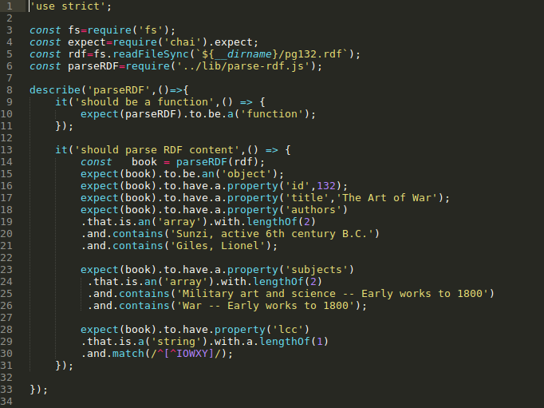
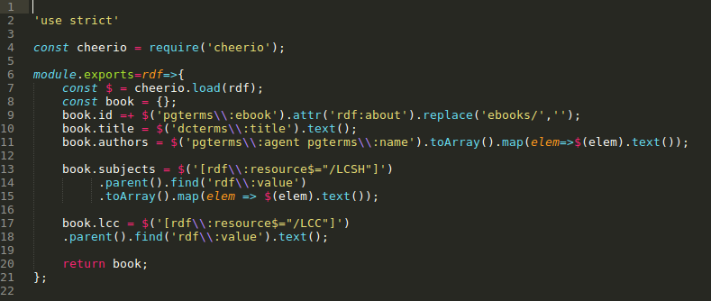
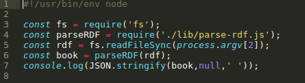
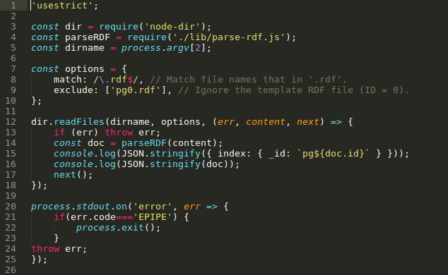

PRÁCTICA 2
===

# 1.INTRODUCCIÓN
En esta práctica usaremos JS para convertir ficheros RDF en formato JSON

# 2.DIRECTORIOS DE TRABAJO
Para desarrollar este programa crearemos dos carpetas:
	$mkdir data
	$mkdir databases

En la primera descagaremos los ficheros RDF y los descomprimiremos con los siguientes comandos:
	$ curl -O http://www.gutenberg.org/cache/epub/feeds/rdf-files.tar.bz2
	$ tar -xvjf rdf-files.tar.bz2

En la segunda es donde guardaremos el código del proyecto, estará dividido en dos carpetas que crearemos así:
	$mkdir test
	$mkdir lib

En la carpeta test guardaremos los tests para el TDD y en el lib losficheros que se encargarán de cambiar los RDF a JSON

# 3.PROGRAMA
## 3.1.LIBRERÍAS Y TESTEO
A continuación, se creará una prueba que falle en un fichero que crearemos en test y llamaremos parse-rdf-test.js y posteriormente se creará el código mínimo que haga que funcione en un fichero dentro de la carpeta lib que llamaremos parse-rdf.js.

Haremos esto continuamente hasta obtener el código final(En mi repositorio se puede ver esa evolución a través de los commits).

Finalmente debería quedar un código como el siguiente:

### parse-rdf-test.js

### parse-rdf.js

## 3.2.PROGRAMA EJECUTABLE TO JSON
Cuando ya tengamos creado lo anterior procederemos a utilizarlo en un ejecutable para obtener la salida deseada

Y debería ser un código como el siguiente:
### rdf-to-json.js

# 3.3.PROGRAMA EJECUTABLE TO BULK
Ahora procederíamos a crear un programa para que el formateo de RDF a JSON se aplicara a todos los ficheros RDF que descargamos:

EL programa es como el siguiente:
### rdf-to-bulk.js

